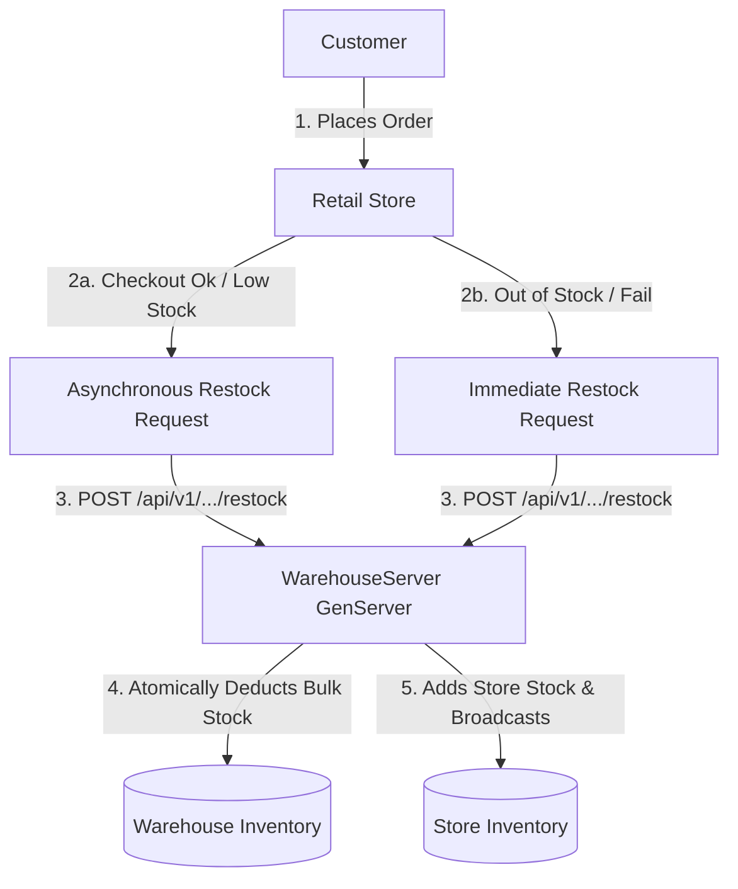

# 🚀 phoenix-shop-warehouse

A real-time e-commerce platform and inventory logistics tracking system built with Elixir, Phoenix, LiveView, Ecto, and Bootstrap.

---

## 📋 Overview

**phoenix-shop-warehouse** is a distributed retail and supply chain simulation application. It demonstrates modern Elixir/OTP patterns by connecting retail stores with central distribution warehouses. The application features a real-time storefront, cart checkout flow with database lock-based race condition prevention, and a visual logistics dashboard that tracks stock levels across the supply chain dynamically.

---

## ✨ Key Features

*   **Storefront Catalog (`/store`)**: A customer-facing portal where users can switch between different retail store locations, browse products, view real-time stock levels, and add items to their shopping cart.
*   **Interactive Shopping Cart (`/cart`)**: A seamless cart checkout interface. During checkout, stock is reserved using database locks. If any item goes out of stock or falls below a threshold, asynchronous replenishment routes are triggered.
*   **Warehouse Logistics Dashboard (`/warehouse/dashboard`)**: A premium internal tool showing:
    *   **Live Logistics & Fulfillment Map**: A dynamic visualization map using SVG connectors linking the Central Distribution Center with retail stores, showing real-time health indicator pulses (Healthy, Low Stock, or Out of Stock).
    *   **Interactive Highlights**: Clickable product thumbnail selectors allowing managers to highlight specific product types globally across all warehouse and store rows.
    *   **Manual Replenishment Actions**: One-click manual restock buttons to transfer inventory from warehouses to stores in real-time.
*   **Real-Time Synchronization**: Utilizes Phoenix PubSub to propagate inventory shifts globally across all open user sessions without manual page refreshes.

---

## 🏢 Business Domain & Partnering Rules

The application models a collaborative supply chain network consisting of **Customers**, **Retail Stores (Shops)**, and **Warehouses** operating under a parent **Enterprise**:



### 1. Customers
*   Customers interact with a single retail store location at a time.
*   Carts are maintained in-memory on the server (`CartRegistry`) keyed by the user's session ID.
*   Upon checkout, the purchase transaction attempts to deduct stock from the selected store.

### 2. Retail Stores (Shops)
*   Each store holds its own inventory of products.
*   Each store specifies a `restock_threshold` (e.g., 5 units) representing the minimum healthy stock level.
*   **Deduction & Locks**: Inventory updates use database row locks (`FOR UPDATE`) to prevent concurrent purchases from double-selling.
*   **Stock replenishment triggers**:
    *   **Low Stock Trigger**: If a purchase is successful but the remaining stock drops below the `restock_threshold`, an asynchronous task triggers a restock request.
    *   **Out of Stock Trigger**: If a purchase fails due to insufficient stock, the checkout transaction rolls back. An immediate restock request is triggered for that product to ensure it becomes available for future attempts.

### 3. Warehouses
*   Warehouses hold wholesale bulk quantities of items.
*   A store can only request restocking from a warehouse belonging to the same parent **Enterprise** (`enterprise_id`).
*   **Serialized Requests**: To prevent race conditions from concurrent replenishment orders, all restock requests for a given warehouse are serialized. They run through a dedicated `WarehouseServer` GenServer, registered under `EnterpriseShop.WarehouseRegistry` by the warehouse's ID.
*   **Restocking Policy**:
    *   If the warehouse has enough stock to cover the request, the GenServer executes a transaction that deducts the quantity from the warehouse and adds it to the store, then broadcasts the update via PubSub.
    *   If the warehouse has insufficient stock, the transaction rolls back with `:insufficient_warehouse_stock` and the restock request fails.

---

## 🏗️ Architecture & Design Principles

The application is structured using **Clean Domain-Driven Design (DDD)** concepts:

```
lib/enterprise_shop/
├── domain/            # Pure Business Entities (Cart, Store, Warehouse, Order, etc.)
├── schemas/           # Ecto Database Schemas & Migrations mapping to Postgres
├── use_cases/         # Transactional Interactors (Checkout, RestockStore)
├── inventory/         # OTP Warehouse GenServers & Supervisors
└── sales/             # In-memory Cart Registries
```

### 1. Pure Domain vs. Database Schemas
*   **Domain Entities** (`lib/enterprise_shop/domain/`): Pure structs containing core business calculations and validation logic (e.g. checking restocking thresholds, deducting/adding quantities). They have no dependency on Ecto or the database.
*   **Schemas** (`lib/enterprise_shop/schemas/`): Standard Ecto schemas representing database tables.

### 2. Transaction Serialisation (WarehouseServer)
To prevent race conditions when restocking a store from warehouse inventory:
*   Restocking actions run through a dedicated GenServer process (`EnterpriseShop.Inventory.WarehouseServer`).
*   Processes are spawned dynamically per warehouse on demand under `EnterpriseShop.WarehouseSupervisor` and registered in `EnterpriseShop.WarehouseRegistry` via a unique registry tuple.
*   Transactions employ Ecto database locks (`FOR UPDATE`) to serialize writes safely.

---

## 🛠️ OTP Supervision Tree

The application tree dynamically manages registries, supervisors, and agents:

1.  `EnterpriseShop.Repo` - Standard database connection wrapper.
2.  `EnterpriseShop.WarehouseRegistry` - Global registry routing calls dynamically to active `WarehouseServer` processes.
3.  `EnterpriseShop.WarehouseSupervisor` - A `DynamicSupervisor` managing warehouse server process lifecycles.
4.  `EnterpriseShop.Sales.CartRegistry` - An in-memory cache tracking active shopping carts across sessions.
5.  `EnterpriseShopWeb.Endpoint` - The Bandit web server handling HTTP requests and WebSocket connections.

---

## 🔌 API Endpoints

The system exposes REST endpoints for third-party logistics integrations:

| Method | Route | Description |
| :--- | :--- | :--- |
| `POST` | `/api/v1/warehouse/restock` | Replenishes store inventory from a specified warehouse. |

---

## 🚀 Getting Started

### Prerequisites

*   Elixir `~> 1.15`
*   Erlang `OTP 26`
*   PostgreSQL running locally

### Installation & Setup

1.  **Run setup alias** to download dependencies, migrate database, and seed initial stores and inventory:
    ```bash
    mix setup
    ```
2.  **Start Phoenix Endpoint**:
    ```bash
    mix phx.server
    # Or run inside IEx for debugging:
    iex -S mix phx.server
    ```
3.  Visit [`localhost:4000`](http://localhost:4000) from your browser.

### Quality Assurance & Linting

Before pushing your changes, always run the precommit pipeline:
```bash
mix precommit
```
This runs the formatter, compiles warnings as errors, unlocks unused dependencies, and runs all test suites.

### Testing

```bash
# Run all tests
mix test

# Run a specific test file
mix test test/enterprise_shop_web/live/warehouse_live_test.exs
```
